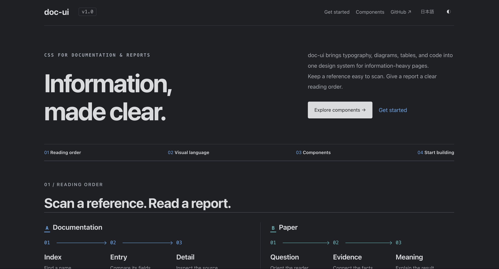

# doc-ui

A CSS design system for documents and reports. Dense catalogs stay easy to scan;
reports make their message clear at a glance. Typography, spacing, tables, and
figures work together, with English and Japanese support.

[Product site](https://k-kinzal.github.io/document-design/) ·
[Components](https://k-kinzal.github.io/document-design/components/) ·
[Storybook](https://k-kinzal.github.io/document-design/storybook/) ·
[日本語](https://k-kinzal.github.io/document-design/ja/)

[](https://k-kinzal.github.io/document-design/)

## Getting Started

Add the stylesheet to your document’s `<head>`:

```html
<link rel="stylesheet"
      href="https://k-kinzal.github.io/document-design/v1.0.0/document-design.css">
```

[Start your first document →](https://k-kinzal.github.io/document-design/start/)
Choose a document or report layout, copy a complete HTML example, and learn about
Japanese typography, themes, offline use, and optional interactions.
