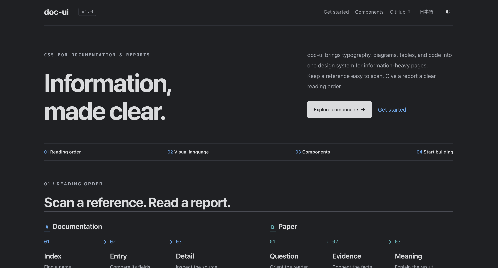

# doc-ui

A CSS design system for documents and reports. Dense catalogs stay easy to scan;
reports make their message clear at a glance. Typography, spacing, tables, and
figures work together, with English and Japanese support.

[Product site](https://k-kinzal.github.io/document-design/) ·
[Components](https://k-kinzal.github.io/document-design/components/) ·
[Storybook](https://k-kinzal.github.io/document-design/storybook/) ·
[npm](https://www.npmjs.com/package/@k-kinzal/doc-ui) ·
[日本語](https://k-kinzal.github.io/document-design/ja/)

[](https://k-kinzal.github.io/document-design/)

## Getting Started

Add the stylesheet to your document’s `<head>`:

```html
<link rel="stylesheet"
      href="https://k-kinzal.github.io/document-design/v1.2.1/document-design.css">
```

[Start your first document →](https://k-kinzal.github.io/document-design/start/)
Choose a document or report layout, copy a complete HTML example, and learn about
Japanese typography, themes, offline use, and optional interactions.

## Markdown to HTML

With Node.js 22 or newer, generate an HTML file with embedded CSS:

```sh
npx @k-kinzal/doc-ui README.md --layout paper -o README.html
```

Choose `doc`, `report`, `paper`, or `book`; use `--lang ja` for Japanese.
Pin `@k-kinzal/doc-ui@1.2.1` for reproducible output.
See the [CLI options and distribution instructions](packages/doc-ui/README.md#markdown-cli).

## Change reports in GitHub Actions

The change-report actions turn a push, pull request, tag range or release into
a self-contained HTML report typeset with doc-ui, written by GitHub Copilot CLI
under your own token. The planned `report-v1` action release is not yet published. See
[packages/doc-report](packages/doc-report/README.md) for the actions,
inputs, permissions and complete example workflows.

[MIT License](LICENSE)
